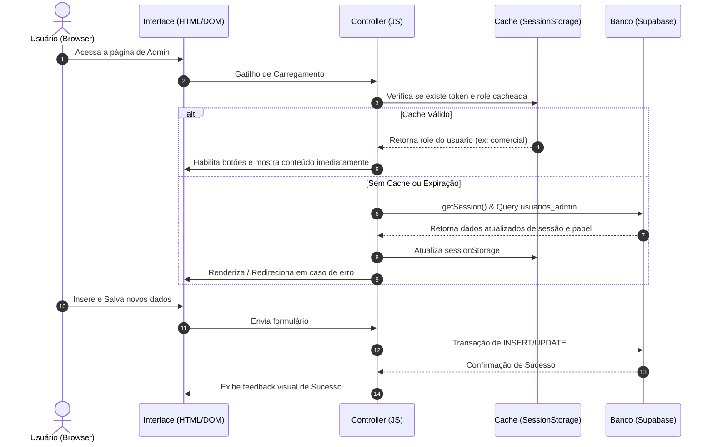

# Documento de Arquitetura de Software: Portal Comercial Rede Conviva

Este documento descreve detalhadamente a arquitetura de software sobre a qual o portal foi construído. O projeto foi projetado com foco em simplicidade, segurança e excelente experiência do usuário (UX), adotando padrões modernos de desenvolvimento web aplicáveis a sistemas estáticos integrados a serviços em nuvem.

---

## 1. Padrão Arquitetural Principal: MVC Adaptado para Web Estática
Embora a aplicação seja composta de páginas HTML estáticas sem o uso de frameworks pesados (como React ou Angular), ela adota uma variação simplificada do clássico padrão **MVC (Model-View-Controller)** diretamente no lado do cliente (Client-Side):

```
+-----------------------------------------------------------+
|                           VIEW                            |
|             Páginas HTML estáticas e CSS                  |
|     (Estrutura de layout e estilização da interface)       |
+------------------------------------+----------------------+
                                     |
              Captura de Eventos     |     Atualização do DOM
              (Clicks, Submits)      |     e Renderização
                                     v
+-----------------------------------------------------------+
|                        CONTROLLER                         |
|                 Classes JavaScript (.js)                  |
|         (LoginController, HubController, etc.)            |
+------------------------------------+----------------------+
                                     |
              Leitura / Escrita      |     Eventos de Estado /
              de Dados               |     Retorno do Banco
                                     v
+-----------------------------------------------------------+
|                          MODEL                            |
|         Supabase BaaS (Banco PostgreSQL + RLS)            |
|         & SessionStorage (Estado Local Temporário)        |
+-----------------------------------------------------------+
```

* **View (Visualização):** Os arquivos `.html` (como `index.html` e `selecao-modulo.html`) servem puramente como a casca estrutural. O arquivo CSS correspondente cuida do layout e design.
* **Controller (Controle):** Os módulos JavaScript (como `login.js` e `hub.js`) mapeiam os elementos do DOM (View), interceptam as interações do usuário, executam a lógica de negócio e se comunicam com os dados (Model).
* **Model (Modelo/Dados):** O estado da aplicação e os dados de persistência residem no **Supabase** (banco relacional remoto) e no cache do navegador (**SessionStorage**).

---

## 2. Paradigma Backend-as-a-Service (BaaS) com Supabase
Em vez de construir um servidor próprio (usando Node.js, Python ou C#) para gerenciar rotas de API, banco de dados e autenticação, a aplicação utiliza a arquitetura **Serverless** por meio de um **BaaS (Backend-as-a-Service)** chamado Supabase.

* **Conexão Direta e Segura:** O frontend se conecta diretamente à API do Supabase através do cliente inicializado no arquivo `supabaseClient.js`.
* **Consumo via ES Modules (ESM):** A biblioteca do Supabase é carregada dinamicamente via CDN usando módulos nativos do ECMAScript, dispensando ferramentas de empacotamento como o Webpack ou Vite.
  ```javascript
  import { createClient } from 'https://cdn.jsdelivr.net/npm/@supabase/supabase-js@2/+esm';
  ```

---

## 3. Fluxo de Autenticação e Segurança (RBAC + JWT)
A segurança da aplicação é estruturada sobre dois pilares fundamentais da engenharia de software:

### A. Autenticação baseada em Tokens (JWT - JSON Web Tokens)
Quando o usuário digita suas credenciais na tela de login, o Supabase valida as informações e retorna um token de acesso seguro (JWT).
* Este token é armazenado automaticamente na sessão do navegador (gerenciado pela biblioteca do Supabase).
* A validação do estado do usuário no início de cada página é feita de forma assíncrona:
  ```javascript
  const { data: { session } } = await supabaseClient.auth.getSession();
  ```
  Se não houver sessão ativa, o usuário é imediatamente redirecionado para a raiz (`index.html`).

### B. Controle de Acesso Baseado em Perfis (RBAC - Role-Based Access Control)
Os privilégios dentro do sistema são segmentados em níveis de permissão (ex: `visualizador`, `marketing`, `comercial`, `mestre_marketing`, `mestre_comercial`, `mestre`).
1. **Tabela de Mapeamento:** Existe uma tabela chamada `usuarios_admin` no banco de dados que associa o e-mail do usuário à sua respectiva função (`funcao`).
2. **Filtro no Frontend:** Páginas restritas como `admin-comercial.html` possuem uma etapa de verificação de papel (Role Verification) que barra o acesso caso o perfil do usuário não confira com as regras estabelecidas.

---

## 4. Técnica de UX: Compensação de Latência (Latency Compensation)
Um problema clássico em sistemas que dependem de bancos de dados em nuvem é o atraso visual (delay/lag) enquanto as requisições de rede acontecem. Para mitigar isso, o portal implementa a técnica de **Compensação de Latência**:

1. **Armazenamento Local Temporário:** Ao efetuar o login com sucesso, a função do usuário é armazenada no `sessionStorage` do navegador.
2. **Renderização Instantânea:** Quando o usuário navega para o painel, o sistema lê imediatamente o perfil a partir do `sessionStorage` e renderiza os botões permitidos instantaneamente, evitando oscilações na tela.
3. **Validação Assíncrona de Background:** Simultaneamente, o sistema faz uma chamada silenciosa ao banco de dados Supabase para validar se aquela permissão ainda é válida. Se houver alguma mudança de perfil no banco, a interface se atualiza em tempo real.

---

## 5. Estrutura de Diretórios e Divisão de Responsabilidades
A organização dos arquivos reflete o princípio da **Separação de Preocupações (Separation of Concerns - SoC)**:

```
├── 📄 *.html                   # As visualizações estruturais (Views)
├── 📂 css/                     # Estilização da interface (arquivos CSS vanilla organizados por módulos)
├── 📂 imagens/                 # Ativos visuais (logos, ícones)
└── 📂 javascript/              # Lógica de controle (Controllers)
    ├── 📄 login.js             # Lógica e comportamento da tela de login
    ├── 📄 hub.js               # Gestão de rotas internas e RBAC do painel comercial
    ├── 📄 admin-comercial.js   # Controle administrativo comercial (cadastros e uploads)
    ├── 📂 marketing/           # Módulos específicos da equipe de marketing
    └── 📂 servicos/
        └── 📄 supabaseClient.js # Centralização de configurações e instâncias da API externa
```

---

## 6. Diagrama de Fluxo de Dados e Comunicação

Abaixo está a visualização de como as camadas interagem desde o acesso inicial até a consulta e modificação de dados:



---

## 7. Melhores Práticas Aplicadas para Estudos de Engenharia de Software

Se você está estudando engenharia de software, preste atenção nestes conceitos aplicados no seu código:
1. **DRY (Don't Repeat Yourself):** A conexão com o Supabase é instanciada apenas uma vez em `supabaseClient.js` e importada nos locais necessários, eliminando duplicações de código.
2. **Defensive Programming (Programação Defensiva):** Há blocos `try/catch` cercando todas as transações de rede. Isso garante que, se o banco falhar ou a internet cair, a aplicação não irá "travar" com uma tela em branco, mas sim exibir uma mensagem amigável de erro.
3. **Desacoplamento:** O CSS não sabe sobre o banco de dados; o HTML não sabe como os dados são validados; o JS não define as regras de estilos visuais (apenas adiciona/remove classes de estado como `style.display = 'none'`). Isso facilita a manutenção futura.
